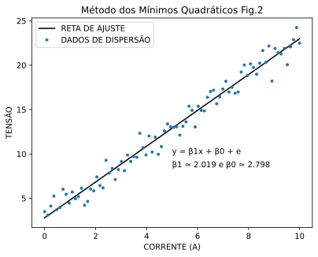
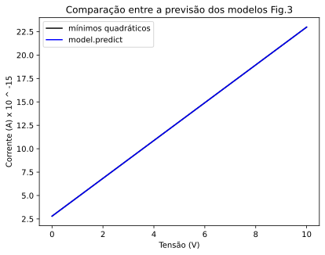
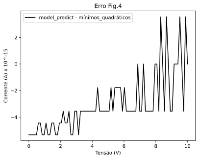

## REGRESSÃO LINEAR

Acho que uma bom tema para iniciar é Regressão Linear, quando comecei no mundo da programação uma das coisas que mais achava interessante eram a manipulação e geeração de gráficos e logo após um tempo as famosas RNA's, e se tem uma coisa que não se pode faltar quando agente fala disso são os gráficos... Mas vamos lá, Nesse poster trago a implementação de um algorítmo fr regressão, um programado apartir de uma fórmula (minimos) e outro apartir da bivliotrca skelearn (skelear.linear_model.LinearRegression();

Para leigos:

A regressão linear é uma ferreamentaque busca modelar a relação entre um conjunto de dados, em outras palavreas ela busca apróximar "funcionamento" de um conjunto de dados com objetivo de prever novos valores. Na matemática voçê já viu falar na equação do 1° grau **y = ax + b**,

### O problema: 

# Problema do Resistor de Grafite

Vamos supor que você se deparou com o seguinte problema: 

Você estava em seu laboratório e estava trabalhando em um resistor feito de grafite de lápis. Para saber sua resistência e incluir essa informação em um artigo, você aplicou um valor de tensão **V** sobre ele e mediu a corrente, utilizando a Lei de Ohm.

**R=V/I**

Após a primeira medição, você chegou a um valor de 100Ω (ohms). Duvidando do resultado, você testou outro valor e obteve 80Ω. Ao realizar várias medições, percebeu que os valores apresentavam leves variações.

Nesse ponto, você quer um valor mais confiável para descrever seu resistor. Uma alternativa é somar todas as observações e calcular a média.
Como você gosta de desafios partiu para a segunda opção:

1. Você fez várias mediçoes:
2. Plotou Todas em um gráfico de corrente por tensão

     ```python
      """##PLOTAGEM DOS DADOS"""
      
      #PRIMEIRO CONTATO COM OS MESMOS DE FORMA GRÁFICA
      #FORMA DE ENCONTRAR POSSÍVEIS ERROS, OUTLIERS
      
      x = np.array(x)
      y = np.array(y)
      plt.figure()
      plt.plot(x, y, '.', color = 'black', ls ='none')
      plt.xlabel('Tensão (V)')
      plt.ylabel('Corrente (A)')
      plt.title( 'Gráfico de dispersão Fig.1')
      plt.savefig('disperção.svg', format='svg',  bbox_inches='tight')
      plt.show()
     ```


A partir deste momento, você já consegue observar o comportamento linear entre **V** e **I**, como é esperado. Basta calcular a reta que melhor aproxima esse conjunto de pontos, algo no formato **y = ax + b**. No nosso caso, isso se traduz em **V = RI**, onde **R = a** (coeficiente angular).
## CONCEITUAÇÃO

- **TARGET:** Variável alvo, neste caso, a corrente em um componente de acordo com a tensão aplicada.
  
- **INSTÂNCIA:** Uma amostra que, neste contexto, refere-se ao par de tensão e sua respectiva corrente, ou seja, a entrada e a saída. Vale salientar que no nosso caso temos uma entrada (V), mas poderia ser um modelo com múltiplas entradas. Nesse caso, a instância seria um vetor de características (features), e o rótulo poderia também ser um vetor.

- **RÓTULO:** O valor esperado para uma determinada entrada. No nosso caso, os valores de \(y\) são os nossos rótulos.

## APRENDIZADO SUPERVISIONADO VS NÃO SUPERVISIONADO

- **Aprendizado Supervisionado:** Neste tipo de aprendizado, os dados de treinamento consistem em um conjunto de entradas e saídas esperadas. O modelo utiliza esses rótulos para calcular métricas, como o erro. Por exemplo, para uma entrada \(b\), o valor predito pelo modelo é comparado ao valor esperado (rótulo). Com essa comparação, o modelo pode ajustar seus parâmetros para melhorar a precisão.

- **Aprendizado Não Supervisionado:** Ao contrário do aprendizado supervisionado, o modelo não tem acesso aos rótulos; ele possui apenas as entradas, sem valores de saída correspondentes. O objetivo, neste caso, é identificar padrões ou estruturas subjacentes nos dados, como agrupamentos ou associações, sem supervisão explícita.

### EXEMPLO PRÁTICO

No nosso caso temos um modelo para prever a corrente \(I\) em um circuito com base na tensão \(V\). Temos os seguintes dados:

<div align="center">

| Tensão (V) | Corrente (A) |
|------------|--------------|
| 5          | 2            |
| 10         | 4            |
| 15         | 6            |

</div>

- **Instância:** Cada linha da tabela representa uma instância. Por exemplo, a instância correspondente a \(5V\) e \(2A\) é uma amostra onde a entrada é \(5V\) e o rótulo é \(2A\).

- **Aprendizado Supervisionado:** Utilizando os dados acima, o modelo aprenderá a mapear a tensão (entrada) para a corrente (rótulo). Se o modelo prever que \(5V\) resulta em \(1.5A\), ele calculará o erro comparando essa previsão com o rótulo \(2A\) para ajustar seus parâmetros.

- **Aprendizado Não Supervisionado:** Se tivermos apenas as tensões sem as correntes, o modelo pode tentar agrupar as tensões em clusters (veremos isso aindada, comentem para eu linkar) com base em padrões identificados, sem saber qual é a corrente associada.

  No aprendizado não supervisionado o modelo não tem accesso aos rótulos ou só temos as entradas e não os valores de sída mesmmo
  
## A primeira forma que vamos utilizar é por meio de métodos analíticos:

### MÉTODO 1: MÉTODO DOS MÍNIMOS QUADRÁTICOS

Um sistema linear simples no formato **y = ax + b** consiste em dois coeficientes:

- **Coeficiente Angular (a)**: Representa a inclinação da reta em relação a **x** ou a variação de **y** em função de **x**.
- **Coeficiente Linear (b)**: Indica onde a reta cruza o eixo **y** ou o valor de **y** quando **x = 0**.

Com esses dois coeficientes, podemos descrever qualquer reta. O **Método dos Mínimos Quadráticos** é uma técnica que, quando aplicada a um conjunto de pontos, encontra os melhores valores dos coeficientes **a** e **b**. Em outras palavras, esse método determina os valores que melhor descrevem o comportamento do conjunto de pontos por meio de uma reta.

Implementei isso em python e plotei os resultados,
Gostaria de destacar apenas a forma que calculei: 

   ```python
         
      """ ##DESEMVOLVENDO A LÓGICA (MÉTODO DOS MÍNIMOS QUADRÁTICOS)
      """
      
      # y = ax + b
      # b = ( n * soma(xi*yi) - soma(xi)*soma(yi)) / (n * soma(xi²) - soma(xi)²)
      #x.shape #84 (quantidade de elementos)
      
      n = x.shape[0]
      xy = x * y
      sum_xy = sum(xy)
      sum_x = sum(x)
      sum_y = sum(y)
      x_qdt = x * x
      
      b = ( n * sum_xy - sum_x*sum_y ) /  (( n *sum(x_qdt)) - ( sum_x * sum_x ))
      print("COEFICIENT ANGULAR:",  b)
      
      def func(x, a, b):
        return x*b + a
      
      # a = media(y) - b*media(x)
      a =  (sum_y/n) - (b*(sum_x/n))
      print("COEFICIENT LINEAR:", a)
   ```
    



### MÉTODO 1: MÉTODO UTILIZANDO A BIBLIOTÉCA SKLEARN

Em poucas linhas conseguimos criar um modelo de aprendizado de máquina e treinalo, em suma 2, o restante é manipulação: 
```python
import matplotlib.pyplot as plt
import numpy as np
import sklearn.linear_model

model = sklearn.linear_model.LinearRegression() # Criando modelo Linear
x = x.reshape(-1,1) # x y são estão no formato (84,), .fit aceita matrizes
y = y.reshape(-1,1) # então crio uma de 1 coluna e a quantidade de linhas a função escolhe (-1)
model.fit(x,y) #treino o modelo no conjunto já tratado
x.shape

print(model.predict([[2], [4]])) #prevê a saída para dois valores
```

Aqui a comparação entre o modelo analítico (MMQT)  e  model.linear_model.LinearRegression(), fica praticaamente inperceptível a diferença:



Aqui podemos ver melhor o erro, veja que é x10^(-15)




Todo o algorítmo e dados utilizados se enontram [aqui](1-REGRESSAO_LINEAR/regressão_liner_ou_métodos_dos_mínimos_quadráticos.py).

 

