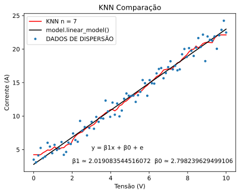

# </> KNN - K NEAREST NEIGHBORS (K VIZINHOS MAIS PRÓXIMOS)
O K-Nearest Neighbors (KNN) é um algoritmo utilizado para análise de padrões em dados, tanto lineares quanto não lineares (em alguns casos). Ao desenvolver um sistema de previsão, é importante que o modelo apresente bom desempenho em dados novos, o que indica uma capacidade de generalização eficaz. Essa capacidade é crucial para a qualidade preditiva do modelo e o aprendizado de máquina se divide principalmente em dois tipos de abordagem:

## Aprendizado Baseado em Instância vs. Aprendizado Baseado em Modelo

### Aprendizado Baseado em Instância
Esse tipo de aprendizado pode ser entendido como um aprendizado de “memorização” ou aprendizado baseado em exemplos. Nele, a previsão é baseada em uma medida de similaridade entre os dados de entrada e o conjunto de dados já observado, ao invés de um modelo geral que descreva as relações subjacentes. 

Por exemplo:
- **Detecção de Fraude em Compras:** Um sistema pode identificar ações suspeitas comparando o número de tentativas de compra em um curto período com o comportamento usual do usuário, ou ainda comparando essas tentativas com padrões conhecidos de fraude.
- **Sistema de Detecção de Spam:** Um sistema de detecção de spam pode identificar e-mails suspeitos ao comparar a frequência de palavras específicas ou a estrutura das frases com padrões conhecidos de mensagens de spam.

Essa abordagem de aprendizado por instância é adequada para problemas em que é mais fácil prever com base na proximidade entre instâncias conhecidas (como KNN), em vez de uma relação matemática formal entre variáveis.

### Aprendizado Baseado em Modelo
No aprendizado baseado em modelo, o foco é entender e modelar a relação entre as entradas e as saídas esperadas. Essa abordagem utiliza algoritmos para construir um modelo generalizável que descreve o padrão ou a estrutura dos dados. A intenção é que o modelo faça previsões confiáveis para dados novos.

Exemplo:
- **Regressão Linear:** No [primeiro tópico](https://github.com/well1ngt0nso/APRENDIZADO_DE_MAQUINA/tree/main/1-REGRESSAO_LINEAR#regress%C3%A3o-linear), usamos um modelo de regressão linear para capturar a relação entre a tensão (V) e a corrente (A) em um componente. Observamos as amostras e inferimos que uma equação linear representaria bem essa relação. Com base nisso, desenvolvemos uma fórmula que melhor descrevesse essa relação, permitindo ao modelo prever a corrente para novos valores de tensão com precisão. Mais especificamente encontramos os coeficientes para adequação na formula de um sistema linear, enquanto na outra abordagem um modelo da biblioteca *sklearn*.

Os modelos baseados em instância, como o KNN, podem ser muito eficazes em problemas onde os dados são variados e dependem muito do contexto imediato (ou da proximidade com outros pontos de dados). Por outro lado, modelos baseados em aprendizado, como a regressão linear, são mais adequados para cenários onde há uma relação previsível e contínua entre variáveis.

> Em resumo, enquanto o aprendizado baseado em instância (como KNN) se apoia em comparações diretas com dados observados, o aprendizado baseado em modelo (como regressão) busca uma equação ou estrutura subjacente que permita capturar a relação entre entradas e saídas.

## DESENVOLVENDO UM MODELO KNN, OU SEJA, BASEADO EM INSTÂNCIA

Iremos fazer isso de duas formas:

1. Utilizando a biblioteca `sklearn`
2. Modelando matematicamente em Python
   
### Utilizando a biblioteca

No primeiro caso, vamos basicamente mudar uma única linha do exemplo já desenvolvido (Regressão Linear).

```python
import matplotlib.pyplot as plt
import numpy as np
import sklearn.neighbors

model = sklearn.neighbors.KNeighborsRegressor(n_neighbors=7  # Criando modelo onde recebe como argumento o número de vizinhos mais próximos (n_neighbors); nesse caso, decidi por 7
x = x.reshape(-1,1)  # Ajustando x para o formato esperado pelo modelo (de (84,) para (84,1))
y = y.reshape(-1,1)  # Ajustando y para o formato esperado pelo modelo

model.fit(x, y)  # Treinando o modelo com o conjunto de dados já tratado

print(model.predict([[2], [4]]))  # Prevê a saída para os valores de entrada 2 e 4
```
Neste exemplo:

- **n_neighbors=4**: Este parâmetro determina o número de vizinhos mais próximos considerados para realizar uma previsão. No KNN, o valor de k (ou n_neighbors) influencia o nível de detalhamento ou suavidade do modelo. Um valor menor (por exemplo, k=1) permite que o modelo capture mais detalhes e peculiaridades dos dados, enquanto um valor maior de k suaviza a previsão, considerando mais vizinhos na média.

- **Formatando x e y**: O uso de reshape(-1,1) transforma os vetores x e y em matrizes de uma coluna, um formato exigido pelo KNeighborsRegressor da biblioteca sklearn. Sem essa estrutura, o modelo não consegue processar os dados corretamente. reshape(-1, 1) indica ao Python para manter o número de linhas conforme necessário (-1 faz o ajuste automático) e definir uma única coluna para a matriz, resultando em um array 2D do tipo (n, 1). Isso ocorre porque a função espera que cada linha seja uma instância e cada coluna uma característica (feature).

Esse método direto, utilizando *sklearn*, facilita o processo de criação, treinamento e previsão com o modelo KNN em apenas algumas linhas de código. A simplicidade deste processo permite a rápida adaptação e uso para explorar o comportamento de novos dados, especialmente em problemas onde uma relação perceptível entre variáveis não é clara, mas onde há um padrão de proximidade ou similaridade entre os dados.

#### Resultado: 

#### Comparação:

 <p align="center">
  
</p>

### Utilizando um algorítmo baseado na ideia matemática 
