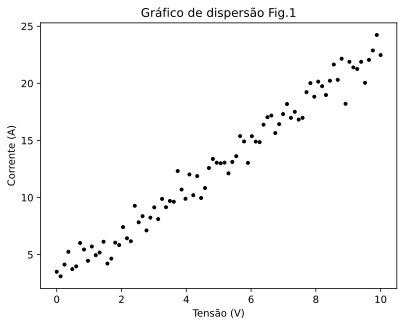

# 🤖 APRENDIZADO_DE_MAQUINA 🤖
O obejetivo desse repositório é trazer conhecimento sobre algorítmos AM atráves principalmente de exemplos, pretendo criar uma pasta para cada algoritmo e uma pasta para conhecimentos gerais

## OBJETIVOS 🎯

* ENTENDER A NATUREZA DO PROBLEMA ALVO 
* ENTENDER COMO DESENVOLVER O ALGORÍTMO
* ENTENEDER EM DETERMINADOS CASOS PARTES DOS PRINCÍPIOS MATEMÁTICOS

Let's Go!!

## REGRESSÃO LINEAR

Acho que uma bom tema para iniciar é Regressão Linear, quando comecei no mundo da programação uma das coisas que mais achava interessante eram a manipulação e geeração de gráficos e logo após um tempo as famosas RNA's, e se tem uma coisa que não se pode faltar quando agente fala disso são os gráficos... Mas vamos lá, Nesse poster trago a implementação de um algorítmo fr regressão, um programado apartir de uma fórmula (minimos) e outro apartir da bivliotrca skelearn (skelear.linear_model.LinearRegression();

Para leigos:

A regressão linear é uma ferreamentaque busca modelar a relação entre um conjunto de dados, em outras palavreas ela busca apróximar "funcionamento" de um conjunto de dados com objetivo de prever novos valores. Na matemática voçê já viu falar na qquação do 1° grau y = ax+b,

### O problema: 

# Problema do Resistor de Grafite

Vamos supor que você se deparou com o seguinte problema: 

Você estava em seu laboratório e estava trabalhando em um resistor feito de grafite de lápis. Para saber sua resistência e incluir essa informação em um artigo, você aplicou um valor de tensão **V** sobre ele e mediu a corrente, utilizando a Lei de Ohm.

***R=V/I***

Após a primeira medição, você chegou a um valor de 100Ω (ohms). Duvidando do resultado, você testou outro valor e obteve 8Ω. Ao realizar várias medições, percebeu que os valores apresentavam leves variações.

Nesse ponto, você quer um valor mais confiável para descrever seu resistor. Uma alternativa é somar todas as observações e calcular a média.
Como você gosta de desafios partiu para a segunda opção:

1. Você fez várias mediçoes:
2. Plotou Todas em um gráfico de corrente por tensão

   

###O que é a regressão LINEAR? 🤔
  
